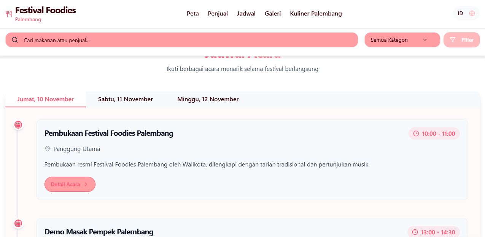

# Festival Foodies Palembang

A web application showcasing food vendors, menus, and events for the Festival Foodies Palembang food festival.




## Overview

This application serves as a digital guide for the annual Festival Foodies Palembang event, celebrating the rich culinary heritage of Palembang, South Sumatra, Indonesia. The platform helps visitors navigate the festival, discover food vendors, view event schedules, and learn about Palembang's unique culinary culture.

## Features

### 🗺️ Interactive Festival Map
- Visual representation of vendor locations at the festival venue
- Color-coded pins based on food categories (main dishes, beverages, snacks)
- Click on pins to view vendor details and menu offerings

### 🍽️ Vendor Listings
- Complete listing of all participating food vendors
- Categorized view with filtering options
- Search functionality to find specific foods or vendors
- Detailed vendor profiles with menus and pricing information

### 📅 Event Schedule
- Comprehensive schedule of all festival events
- Day and time information for demonstrations, workshops, and performances
- Event details including descriptions and locations

### 📷 Photo Gallery
- Curated collection of festival highlights and food imagery
- Visual showcase of Palembang cuisine and festival atmosphere

### 🥘 Culinary Culture Section
- Informative content about Palembang's traditional cuisine
- Descriptions of signature dishes and their cultural significance
- History and culinary influences of Palembang food

### 🌐 Bilingual Support
- Complete language toggle between Indonesian and English
- All content, including vendor information and event details, available in both languages

## Tech Stack

- **Frontend**: React, TailwindCSS, Shadcn UI components
- **State Management**: React Query for data fetching
- **Backend**: Express.js
- **Data Storage**: In-memory storage implementation
- **Languages**: TypeScript for type safety

## Getting Started

### Prerequisites

- Node.js (v20+)
- npm

### Installation

1. Clone the repository:
   ```
   git clone https://github.com/yourusername/festival-foodies-palembang.git
   cd festival-foodies-palembang
   ```

2. Install dependencies:
   ```
   npm install
   ```

3. Start the development server:
   ```
   npm run dev
   ```

4. Open your browser and navigate to:
   ```
   http://localhost:5000
   ```

## Project Structure

```
├── client
│   ├── src
│   │   ├── components - UI components
│   │   ├── context - React context providers
│   │   ├── hooks - Custom React hooks
│   │   ├── lib - Utility functions and types
│   │   ├── locale - Translations
│   │   ├── pages - Page components
│   │   ├── App.tsx - Main app component
│   │   └── main.tsx - Entry point
│   └── index.html - HTML template
├── server
│   ├── index.ts - Server entry point
│   ├── routes.ts - API route definitions
│   ├── storage.ts - Data storage implementation
│   └── vite.ts - Vite server configuration
└── shared
    └── schema.ts - Shared data schemas
```

## API Endpoints

- `/api/vendors` - Get all food vendors
- `/api/vendors/:id` - Get details for a specific vendor
- `/api/menu-items/:vendorId` - Get menu items for a specific vendor
- `/api/events` - Get all festival events
- `/api/photos` - Get gallery photos
- `/api/categories` - Get food categories
- `/api/festival-info` - Get festival details and information

## Further Development

Potential future enhancements for the application:

- User authentication for personalized experiences
- Pre-ordering system for popular vendors
- Ratings and reviews for food vendors
- Interactive food recommendations based on preferences
- Integration with local payment systems
- Mobile app version with offline capabilities

## License

This project is licensed under the MIT License - see the LICENSE file for details.

## Acknowledgements

- Palembang Tourism Board for festival information
- Local vendors for their participation and content
- The React and TypeScript communities for their excellent tools and documentation

habizinnia@gmail.com